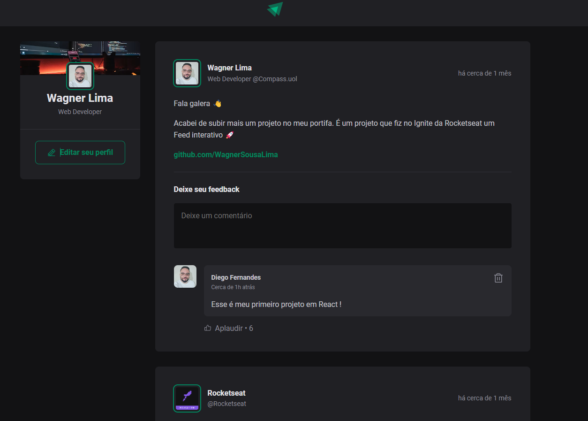

<h1 align="center"> Ignite Feed </h1>

 

  
  ## 💻 Projeto

Ignite feed é um projeto que simula o feed das redes sociais, 
com funcionalidades de comentários, likes e apagar comentário.

## 🚀 Tecnologias

Esse projeto foi desenvolvido com as seguintes tecnologias:

 HTML e CSS 
 JavaScript 
 ReactJs e Vite 
 Date-fns e Phosphor-react 
 Git e Github

## 🔖 Layout

Você pode visualizar o layout do projeto através [DESSE LINK](https://www.figma.com/community/file/1113573231685349036/Ignite-Feed). É necessário ter conta no [Figma](https://figma.com) para acessá-lo.

Projeto Desenvolvido na trilha Ignite da Rocketseat
 

